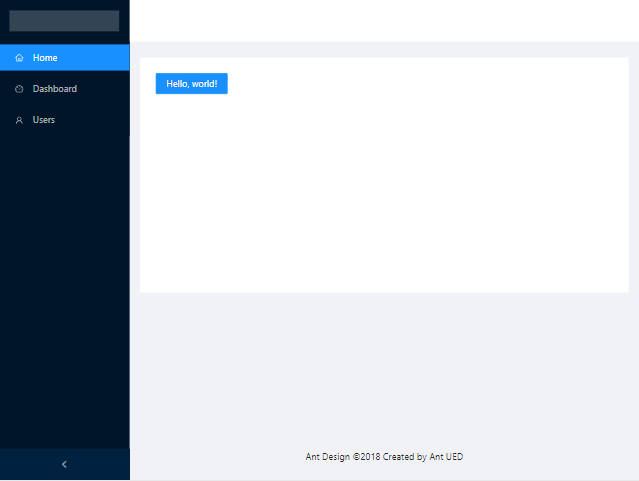
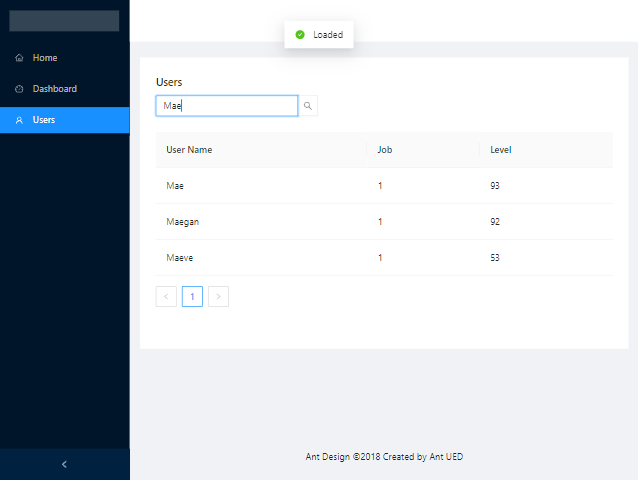

# Blazor WebAssembly + Asp.net Hosted + Ant Design

목차
1. [Ant Design을 Client 프로젝트에 설치](#ant-design을-client-프로젝트에-설치)
2. [Ant Design Layout 적용하기](#ant-design-layout-적용하기)
3. [Users 페이지 꾸며보기](#users-페이지-꾸며보기)
4. [참고 자료](#참고-자료)

## Ant Design을 Client 프로젝트에 설치

1. AntDesign Package를 설치 합니다. (샘플 설치 버전 : 0.15.0)
2. Service를 추가 합니다.
   ```csharp
   // Program.cs

    builder.Services.AddAntDesign();
   ```
3. Ant Design의 css와 js를 추가 합니다.
   ```html
   <!-- wwwroot/index.html -->
   
   <link href="_content/AntDesign/css/ant-design-blazor.css" rel="stylesheet" />
   <script src="_content/AntDesign/js/ant-design-blazor.js"></script>
   ```
4. 전역으로 사용 할 수 있도록 namespace 추가 합니다.
   ```csharp
   // _Imports.razor 
   
   @using AntDesign
   ```
5. 팝업 구성 요소를 동적으로 표시 하기 위해 구성 요소를 추가 합니다.
   ```csharp
   // App.razor
   
   <AntContainer />
   ```
6. (적용 확인) Ant Design Component를 사용해 봅니다.
   ```csharp
   // Pages/Index.razor
   
   <Button Type="@ButtonType.Primary">Hello, world!</Button>
   ```
   동작 이미지

   

## Ant Design Layout 적용하기

적용 예)



[참고](https://antblazor.com/en-US/components/layout#components-layout-demo-side)

### Layout 수정하기

MainLayout.raozr를 통해 홈페이지의 전체 Layout을 만들 수 있습니다.

Page에 내용은 @Body를 통해 출력이 됩니다.

1. layout 수정 하기
   ```csharp
   <Layout Style="min-height: 100vh; ">
       <Sider Collapsible>
           <div class="logo"/>
           <Menu Theme="MenuTheme.Dark" DefaultSelectedKeys=@(new[] { "1" }) Mode="MenuMode.Inline">
               <MenuItem Key="1" RouterLink="/" RouterMatch="NavLinkMatch.All">
                   <Icon Type="@IconType.Outline.Home" Theme="outline"/>
                   <span>Home</span>
               </MenuItem>
               <MenuItem Key="2" RouterLink="Dashboard" RouterMatch="NavLinkMatch.Prefix">
                   <Icon Type="@IconType.Outline.Dashboard" Theme="outline"/>
                   <span>Dashboard</span>
               </MenuItem>
               <MenuItem Key="3" RouterLink="Users" RouterMatch="NavLinkMatch.Prefix">
                   <Icon Type="@IconType.Outline.User" Theme="outline"/>
                   <span>Users</span>
               </MenuItem>
           </Menu>
       </Sider>
       <Layout Class="site-layout">
           <Header Class="site-layout-background" Style=" padding: 0 ;"></Header>
           <Content Style="margin:0 16px;">
               <div class="site-layout-background" style="margin-top:24px; padding: 24px; min-height: 360px">
                   @Body
               </div>
           </Content>
           <Footer Style="text-align:center ">Ant Design ©2018 Created by Ant UED</Footer>
       </Layout>
   </Layout>
   ```
2. 전역 css 추가 하기
   ```css
   /* wwwroot/css/app.css */
   
   .logo {
       height: 32px;
       background: rgba(255, 255, 255, 0.2);
       margin: 16px;
   }
   
   .site-layout .site-layout-background {
       background: #fff;
   }
   ```

## Users 페이지 꾸며보기

Users 페이지에 사용자 검색 기능을 추가 하여, 목록을 조회 하는 페이지를 만들어 봅니다.

Ant Design의 Component를 이용하여 간단히 구현 할 수 있습니다.


적용 예)



### Server 프로젝트에 UserController 만들기
1. UserController 만들기 (Repository는 생략 하겠습니다.)

   - Client에서 사용 할 api를 server에서 controller로 구현을 합니다.
   ```csharp
   // Controllers/UsersController.cs
   [ApiController]
   [Route("api/[controller]")]
   public sealed class UserController : ControllerBase
   {
       private readonly IUserRepository _userRepository;
   
       public UserController(IUserRepository userRepository)
       {
           _userRepository = userRepository ?? throw new ArgumentNullException(nameof(userRepository));
       }
   
       [HttpGet("findUsers")]
       public async Task<ActionResult> FindUsersAsync([FromQuery] string? searchName)
       {
           await Task.Delay(TimeSpan.FromMilliseconds(RandomNumber.Next(100, 5000)));
   
           return Ok(_userRepository.FindUsers(searchName ?? string.Empty));
       }
   }
   ```

### Client 프로젝트에서 Users 페이지 꾸미기
1. Users 페이지 간단한 레이아웃을 구성해 봅니다.
   ```csharp
   // Pages/Users.razor

   <Space Size="@AntSizeLDSType.Large" Direction="@DirectionVHType.Vertical" Style="width: 100%">
       <SpaceItem>
           <Search Placeholder="input search name" WrapperStyle="width: 250px"
                   OnSearch="OnSearchCallbackAsync"/>
       </SpaceItem>
       <SpaceItem>
           <Table DataSource="@_users">
               <GenerateColumns/>
           </Table>
       </SpaceItem>
   </Space>
   ```
   Space Component를 이용하면 간단하게 레이아웃을 구성 할 수 있습니다.<br>
   그리고 검색을 위해 Search Component를 사용하고, Table Component를 이용하여 목록을 출력 합니다.<br><br>

   [참고]
   - Space : https://antblazor.com/en-US/components/space
   - Search : https://antblazor.com/en-US/components/input#components-input-demo-SearchBox
   - Table : https://antblazor.com/en-US/components/table
2. Server에 api 요청을 하기 위해 정의된 HttpClient를 가져옵니다.<br>
    (HttpClient는 DI를 통해 가져올 수 있습니다.)
   ```csharp
   // Pages/Users.razor

   @inject HttpClient HttpClient
   ```
3. 검색 버튼을 눌렀을 때 Api를 호출하여 결과 값을 가져오는 걸 만들어 봅시다.
   ```csharp
   // Pages/Users.razor
   
   private IReadOnlyList<UserRecord> _users = new List<UserRecord>();
   
   private async Task OnSearchCallbackAsync(string searchName)
   {
       _users = await HttpClient.GetFromJsonAsync<List<UserRecord>>($"api/User/findUsers?searchName={searchName}")
                ?? throw new InvalidOperationException();
   }
   ``` 
   HttpClient에서 데이터 요청 시 프로토콜에 따른 Json Deserialize를 지원 합니다.<br>
   거기에 맞춰 사용 하시면 됩니다.<br>
   _users 변수를 Component와 바인딩을 하였기 때문에 자동으로 Table에 출력 합니다.

## 참고 자료

- Ant Design Blazor : https://antblazor.com/en-US/
- Ant Design Component : https://antblazor.com/en-US/components/overview